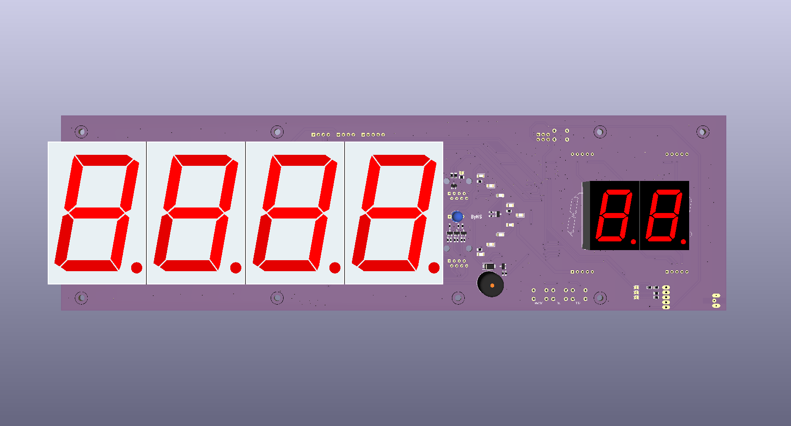
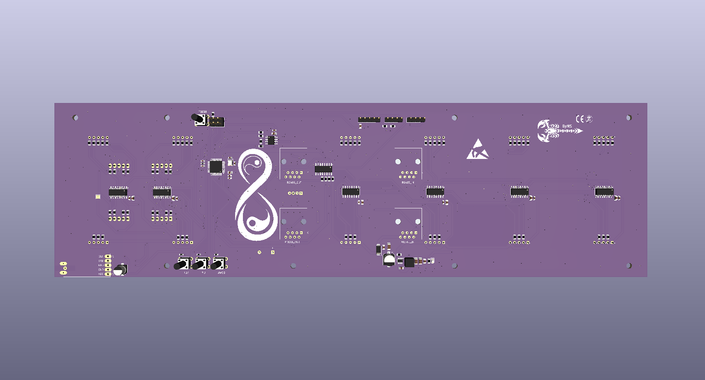
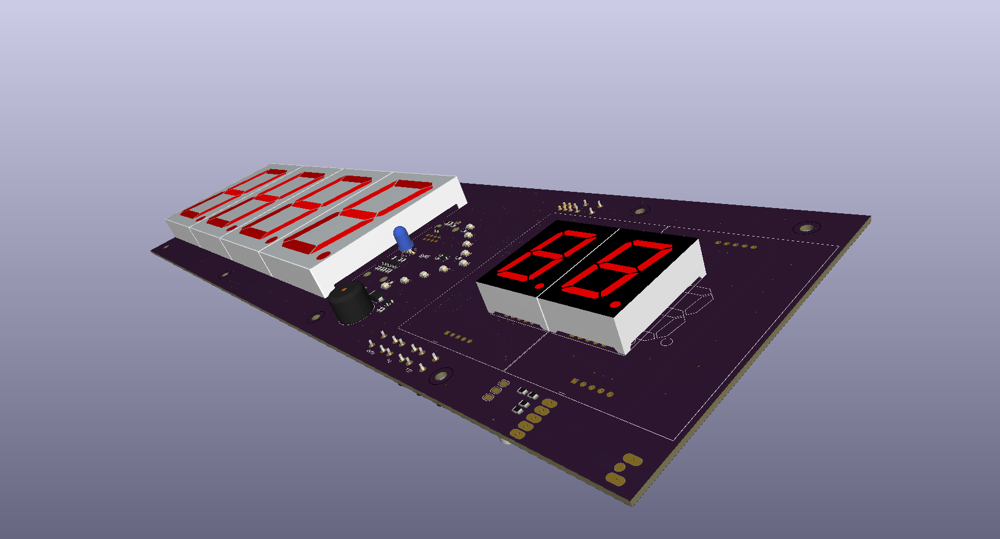

# Queue Local Display – ATmega328PB

A modular local queue display controller designed for queue management systems used in hospitals, banks, clinics, public institutions, service counters, and similar environments.

The system is built around the **Microchip ATmega328PB** microcontroller and supports both wired **RS-485 communication** and optional **433 MHz HC-12 wireless communication**.

The display section uses cascaded **HEF4094BT shift registers**, allowing multiple large 7-segment displays to be controlled with only a few MCU pins.

## Features

* Microchip **ATmega328PB**
* 5 V MCU operation
* External **16 MHz crystal**
* 12 V DC input
* **AP63205WU-7** synchronous buck converter for 12 V to 5 V
* **MAX485** RS-485 interface
* Optional **HC-12 433 MHz wireless module**
* Independent hardware UARTs for RS-485 and HC-12
* **HEF4094BT** cascaded display architecture
* **ULN2003A** 5 V to 12 V logic interface
* Static-drive 7-segment display architecture
* 4 × large 56 mm queue-number displays
* 2 × auxiliary 7-segment displays
* EEPROM-based device addressing
* SET / UP / DOWN configuration buttons
* PWM-capable global display brightness control
* External I²C expansion interface
* Additional GPIO expansion pins
* RS-485 daisy-chain capability
* Optional RS-485 termination
* Designed for continuous **24/7 operation**

## 3D Preview

### Top & Bottom Views

<p align="center">
  
  
</p>

### Angled View

<p align="center">
  
</p>
## Manufacturing Files

Ready-to-manufacture Gerber and drill files are provided for this PCB.

- 📁 [Browse Gerber Files](Hardware/Gerber)
- 📦 [Download Complete Gerber ZIP](Hardware/Gerber/Queue_Local_Display_Atmega328PB_GERBER.zip)
- 🛠️ [KiCad Source Files](Hardware/KiCad)

The Gerber package includes the copper, solder mask, silkscreen, solder paste, board outline, plated-hole and non-plated-hole drill files required for PCB fabrication.

### PCB Specifications

| Parameter | Specification |
| --- | --- |
| Layers | 2 |
| PCB Thickness | 1.6 mm |
| Material | FR-4 |
| Copper Thickness | 35 µm / 1 oz |
| Board Size | approximately 340.05 × 100.05 mm |

> **Note:** Always verify the Gerber files and manufacturing parameters with your PCB manufacturer before placing an order.

## Display Configuration

The board uses:

### Main Queue Number

* 4 × **SM412301N**
* 2.3 inch / approximately 56 mm
* Red
* Common Anode

### Counter / Desk Number

* 2 × **FJ11001AH**
* Red 7-segment display

Example display format:

```text
+--------------------------------+
|                                |
|       A 1 4 5       0 3        |
|                                |
|       QUEUE        COUNTER      |
+--------------------------------+
```

## Display Driver Architecture

Each 7-segment digit is controlled by its own **HEF4094BT** shift register.

The shift registers are connected in cascade:

```text
ATmega328PB
     |
     | DATA
     v
 HEF4094 #1
     |
    QS2
     v
 HEF4094 #2
     |
    QS2
     v
 HEF4094 #3
     |
    QS2
     v
 HEF4094 #4
     |
    QS2
     v
 HEF4094 #5
     |
    QS2
     v
 HEF4094 #6
```

CLOCK, STROBE and OE lines are shared between all HEF4094 devices.

The HEF4094 devices operate from the **12 V rail**.

A **ULN2003A open-collector interface** with 12 V pull-up resistors is used between the 5 V ATmega328PB and the 12 V HEF4094 control inputs.

## HEF4094 Control Pins

| Function | ATmega328PB |
| -------- | ----------- |
| DATA     | D4          |
| OE       | D5          |
| CLOCK    | D6          |
| STROBE   | D7          |

The OE line is connected to a PWM-capable MCU output, allowing global display brightness control.

## RS-485 Interface

The board uses a **MAX485** half-duplex RS-485 transceiver.

| Function  | ATmega328PB |
| --------- | ----------- |
| RS-485 RX | PD0 / RXD0  |
| RS-485 TX | PD1 / TXD0  |
| RE + DE   | PB0 / D8    |

The RE and DE pins are connected together and controlled from a single GPIO.

The board is designed for **RS-485 bus / daisy-chain wiring**.

```text
MASTER
   |
LOCAL DISPLAY 01
   |
LOCAL DISPLAY 02
   |
LOCAL DISPLAY 03
   |
LOCAL DISPLAY 04
```

A termination resistor footprint is provided for installations where the display is located at the physical end of the RS-485 bus.

## HC-12 Wireless Interface

An optional **HC-12 433 MHz UART module** can be installed.

ATmega328PB USART1 is used for wireless communication.

| Function  | ATmega328PB |
| --------- | ----------- |
| HC-12 RX  | PB3 / TXD1  |
| HC-12 TX  | PB4 / RXD1  |
| HC-12 SET | PB2 / D10   |

The SET input includes a pull-up resistor to keep the HC-12 in normal operating mode during startup.

## Device Address Configuration

Each local display can be assigned an individual device address.

Three buttons are used:

* **SET**
* **UP**
* **DOWN**

The selected address is stored in the internal EEPROM of the ATmega328PB.

This eliminates the need for DIP switches and simplifies installation and field configuration.

## Power Architecture

```text
12 V DC INPUT
      |
      +--------------------> Displays / HEF4094 / LEDs
      |
      +----> AP63205WU-7
                  |
                  v
                 5 V
                  |
                  +----> ATmega328PB
                  +----> MAX485
                  +----> HC-12
```

The **AP63205WU-7** provides the regulated 5 V logic supply.

The 12 V rail directly supplies the display driver section and external indicators.

## Expansion

Unused ATmega328PB GPIO pins are exposed for future expansion.

Possible future uses include:

* Status LEDs
* Additional buttons
* External sensors
* Relay outputs
* ADC inputs
* Interrupt inputs
* Additional I²C devices
* External indicators

The primary external I²C interface is:

```text
PC4 → SDA0
PC5 → SCL0
```

## Applications

* Hospital queue systems
* Bank queue systems
* Clinic waiting-room displays
* Government service counters
* Pharmacy queue systems
* Restaurant queue systems
* Reception systems
* Service desk displays

## Modular Architecture

The hardware is designed with future modular expansion in mind.

Multiple local display boards can later be combined to create a multi-row **main queue display**, while maintaining a common hardware platform.

## Project Status

**Hardware Design:** Completed
**Firmware:** In Development
**Production Validation:** Pending

This project is currently in the prototype and validation stage.

## Disclaimer

This hardware should be fully tested and validated before use in commercial, medical, industrial, or safety-critical installations.
